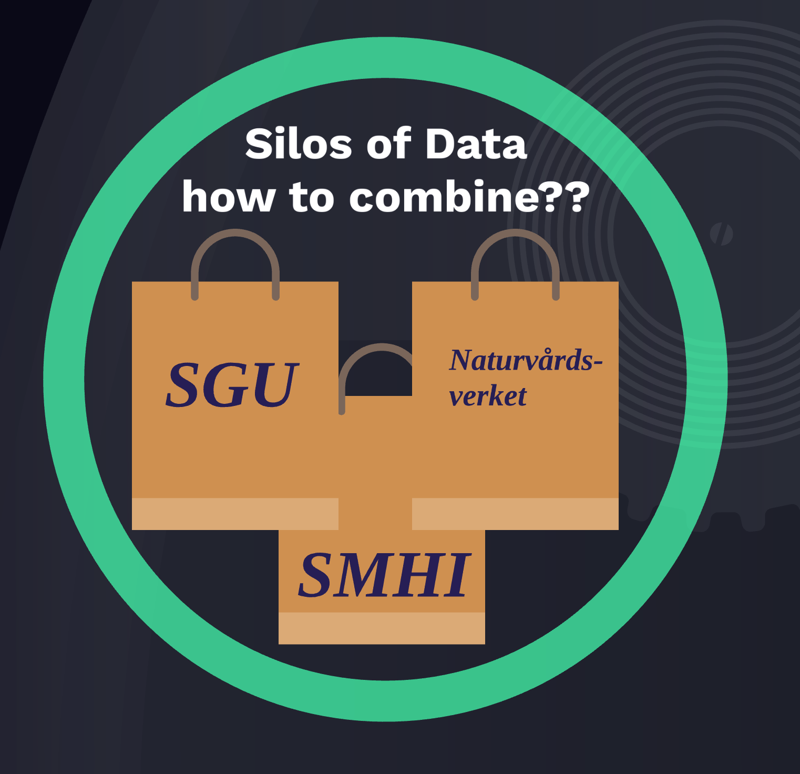
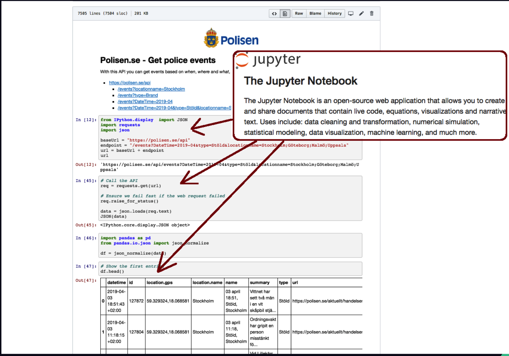
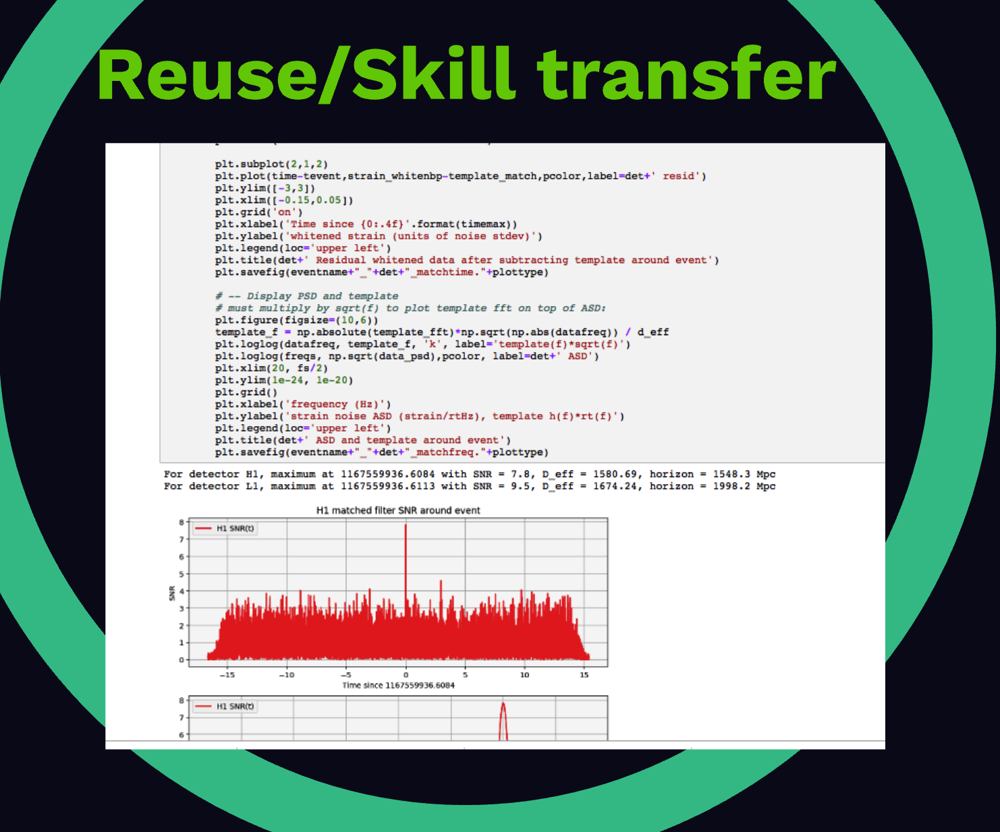

* Presentation Hack4Sweden "[Maximize the usage of Open Data](https://prezi.com/gxli-bpyese7/?utm_campaign=share&utm_medium=copy)" - **Eat your own Dog food** - [tweet](https://twitter.com/salgo60/status/1114848533906108416)

# Open Data Examples - Hack for Sweden 2019

These Jupyter Notebooks contains examples on how to access open data through APIs. It was made for Hack for Sweden 2019.

If you want to work with the examples during the hack, I recommend using https://jupyter.se where you login with a Google account and get started with the README. You can also run these examples on mybinder.org, but inactivity will shut you down and work wont be saved.

# Examples

## Polisen.se - Get police events
With this API you can get events based on _when_, _where_ and _what_, for more details [read this](https://polisen.se/om-polisen/om-webbplatsen/oppna-data/api-over-polisens-handelser/).

- [polisen-se.ipynb](polisen-se.ipynb) - added by [@salgo60](https://github.com/salgo60)

## Försäkringskassan - Get statistics
From this API you get summarizing statistics of the registered stress related diseases that Försäkringskassan is compensating. The information is described on a county and municipality level on a quarterly basis.

For more details, see the [reference documentation](https://oppnadata.se/datamangd/#esc_entry=4778&esc_context=547).
- [Försäkringskassan.ipynb](Försäkringskassan.ipynb) - added by [@salgo60](https://github.com/salgo60)

## SGU - Platser för miljöövervakning: Datavärdskap Grundvatten
Getting data from locations of groundmeasurements of groundwater, for more details [read this](https://www.sgu.se/grundvatten/miljoovervakning-av-grundvatten/datavardskap-for-grundvatten/).

- [SGU.ipynb](SGU.ipynb) - added by [salgo60](https://github.com/salgo60)

## Vinnova  - API for get calls for proposal
For more [details](https://www.vinnova.se/en/apply-for-funding/find-the-right-funding/) / [API](https://www.vinnova.se/om-oss/kontakta-oss/om-webbplatsen/oppen-data/)

- [Vinnova.ipynb](Vinnova.ipynb) - added by [salgo60](https://github.com/salgo60)

## Wikidata.org - Get info from the Wikipedia project
Wikidata provides machine readable data from the Wikipedia project, licenced under a Creative Commons "No rights reserved" licence called [CC-0](https://creativecommons.org/share-your-work/public-domain/cc0/).

- [wikidata-org.ipynb](wikidata-org.ipynb) - added by [salgo60](https://github.com/salgo60) along with this [video](https://youtu.be/HrfQioXjGZE)

## Misc
* Presentation Hack4Sweden "[Maximize the usage of Open Data](https://prezi.com/gxli-bpyese7/?utm_campaign=share&utm_medium=copy)"
Notebooks)
### OPEN DATA
* Github [Explore open data Zürich](https://github.com/wildtreetech/explore-open-data)
* Github [Open Data Bikes Analysis Bordeaux and Lyon](https://github.com/Oslandia/open-data-bikes-analysis)
* Github [Cannabis sales reports data in Colorado](https://github.com/cjwinchester/co-weed-sales-data) Jupyter [notebook](https://github.com/cjwinchester/co-weed-sales-data/blob/master/Analysis%20of%20Colorado%20cannabis%20sales%20data.ipynb)

### JUPYTER
* More advanced [Jupyter examples](https://github.com/minrk/ligo-binder/blob/master/index.ipynb)
* "[Interactive Controls in Jupyter Notebooks](https://towardsdatascience.com/interactive-controls-for-jupyter-notebooks-f5c94829aee6)"
* [Why Jupyter is data scientists’ computational notebook of choice](https://www.nature.com/articles/d41586-018-07196-1)
* [A gallery of interesting Jupyter Notebooks](https://github.com/jupyter/jupyter/wiki/A-gallery-of-interesting-Jupyter-Notebooks)
* [jupyter book](https://jupyterbook.org/intro.html)
* [Estimate of Public Jupyter Notebooks on GitHub](https://nbviewer.jupyter.org/github/parente/nbestimate/blob/master/estimate.ipynb) 4 000 000 2019-03-27
## Open data challenge

